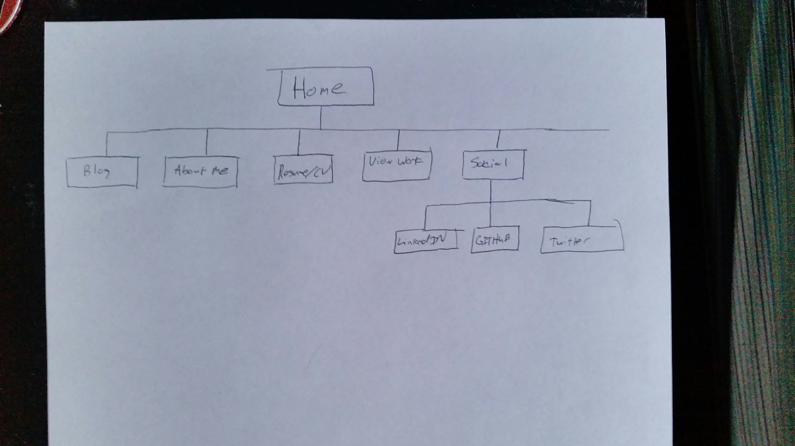

## Site Map Reflection

- What are the 6 Phases of Web Design?
- What is your site's primary goal or purpose? What kind of content will your site feature?
- What is your target audience's interests and how do you see your site addressing them?
- What is the primary "action" the user should take when coming to your site? Do you want them to search for information, contact you, or see your portfolio? It's ok to have several actions at once, or different actions for different kinds of visitors.
- What are the main things someone should know about design and user experience?
- What is user experience design and why is it valuable? 
- Which parts of the challenge did you find tedious?

In this assignment, I learned about the foundations of design thinking and what is the thought process of designing a website. I never thought of myself as a "designer" by any means, so this entire process is absolutely new to me. I always thought that UI designers had to be extremely creative, and did not know you can acutally learn through practice. 

The six phases of web design:
- Information Gathering
Consider who your target audience is, the purpose of your website, the goal of your website, and what content you should put in your website. 
- Planning (create a site map)
- Design 
In this phase, you want to design the look and feel of your site. Determine what fonts you want to use and also consider your target audience. In addition, decide what colors you want to use, and create a wireframe.  
- Development
The development phase is to make your page look like the design you came up with. Use HTML and CSS to style your page. 
- Testing and Delivery
In this phase, you want to make sure all of your links are working. In addition, you should check for cross-functionality between different platforms (browsers, mobile devices, etc.) Make sure everything is scaled the correct way, and get feedback from your peers about the website. 
- Maintenance
Maintenance is the process where you make improvements and updates to your page. You don't want your website to become stale and bugs can arise. Make sure you are continually updating your site. 

The primary goal of my professional website is to demonstrate my professional work of various projects and professional background to potential employers in an unique and interactive way. In my site, I will feature my CV, social media sites, projects, a brief background about me and my interests, and my blog. My target audience will be potential employers in the tech startup and corporate field. My target audience should have an interest in hiring new software developers that demonstrate competencies to fulfill their specific role. I hope to point my target audience in the direction of my projects and my CV because that is most likely what they want to see. I do not desire my website to be cluttured with too much information because it would distract them away from the primary purpose of this website.

The primary "action" the user should be taking is reading a short description of my interest that will be featured on my home page. I want them to click on my portfolio and CV so I can demonstrate my work. In addition, I'd like for my website to have a clean and interactive feel so it can demonstrate my ability to create a clean website. My social media links and blog could act as supplemental material to enhance my overall portfolio. By clicking on my portfolio and CV, potential employers could contact me through there, instead of having a seperate area for contact information. In my opinion, I think that is unnecessary and should be embedded in the CV, portfolio, and home page. 

Some of the main things people should know about design and user experience is target audience, goals, and purpose of the website. You should design your site around these factors because it will determine what type of layout you want the site to be, the different fonts, and how your website flows. 

User experience design is the concept of improving the user experience in your site. The way the user interacts with the site, the ease of how to navigate through your site, and how satisfied the user is with your site is all part of the user experience design. The goal of user experience design is to enhance the overall experience of the user. They should be able to navigate easily to your product and not be confused by the design of your site. 

I wouldn't say any part of the challenge was "tedious". However, I found that the whole user experience and those factors challenging. At times, I felt overwhelmed when determining how I should design my site and had too many ideas floating around. It was difficult to fully comprehend all of the different factors of user experience design because I know people have years of experience when desigining sites. However, this opened my eyes into what user experience is all about and I am willing to learn more. 