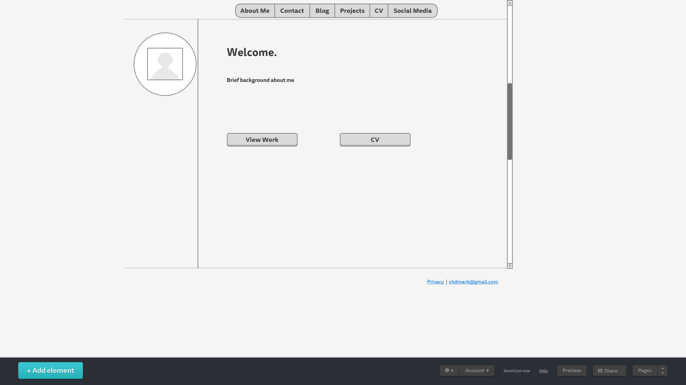

## Wireframing Reflection

- What is a wireframe?
- What are the benefits of wireframing?
- Did you enjoy wireframing your site?
- Did you revise your wireframe or stick with your first idea?
- What questions did you ask during this challenge? What resources did you find to help you answer them?
-Which parts of the challenge did you enjoy and which parts did you find tedious?

For this assignment, I learned how to design a wireframe for my site. I am not artistic by any means, so I found this assignment more on the challenging side. However, I was able to use Mockingbird to initiate the process. 

A wireframe is essentially a sketch, diagram, or a rough framework of your website. The wireframe should include all of the buttons you want to use, the links you want to include, and the overall workflow of your website. Wireframing your site has many benefits. For starters, it helps with the actual coding process of your site. Because you know where each section is located, it makes it easier for you to develop your site as opposed to designing while coding. This makes the process more efficient. In addition, you can navigate through your site with ease. Wireframing is also beneficial because you can make changes before you actually code. Let's say you started the coding process and wanted to make a change. You would have to erase the entire code and this would be extremely inefficient. 

At first, wireframing was difficult for me. As I mentioned above, I used [Mockingbird](https://www.gomockingbird.com) to help me design my wireframe. I would recommend anyone who isn't naturally artistic (like myself) to use this site! After discovering Mockingbird, I started to enjoy the process a bit more. I also looked for some of my favorite websites for inspiration. I definitely revised my wireframe during this challenge. I can see how you can spend a lot of time on wireframing. 

I asked myself what were the best wireframing practices? It turns out that having the best clarity for your wireframe is essential. I looked at this blog [post](http://uxmovement.com/wireframes/why-the-best-wireframe-style-is-no-style/) for some reasearch. It helped me decide to use Mockingbird because I found it clear for me. 

I found playing with different buttons on Mockingbird enjoyable. Designing a website usually scared me because I'm not creative. I was able to draw straight lines and make the wireframe look clean which I thought was awesome! The parts I found tedious were the placement of where I wanted my material. I found myself reorganizing too much because I wanted my site to be different. Little tweaks here and there wasted some of my time. I need to learn how to be more efficient when I am wireframing. 