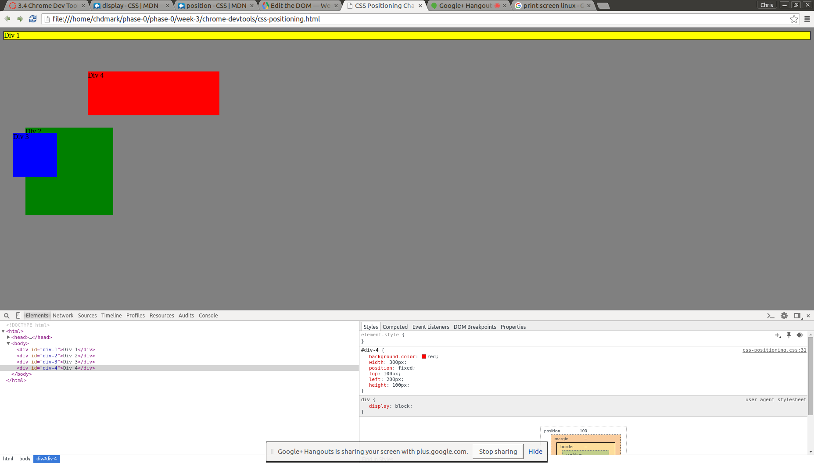
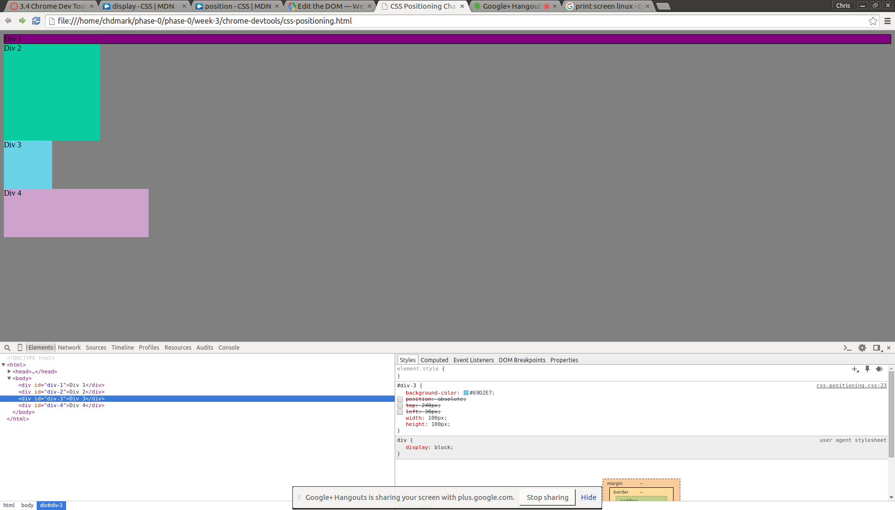
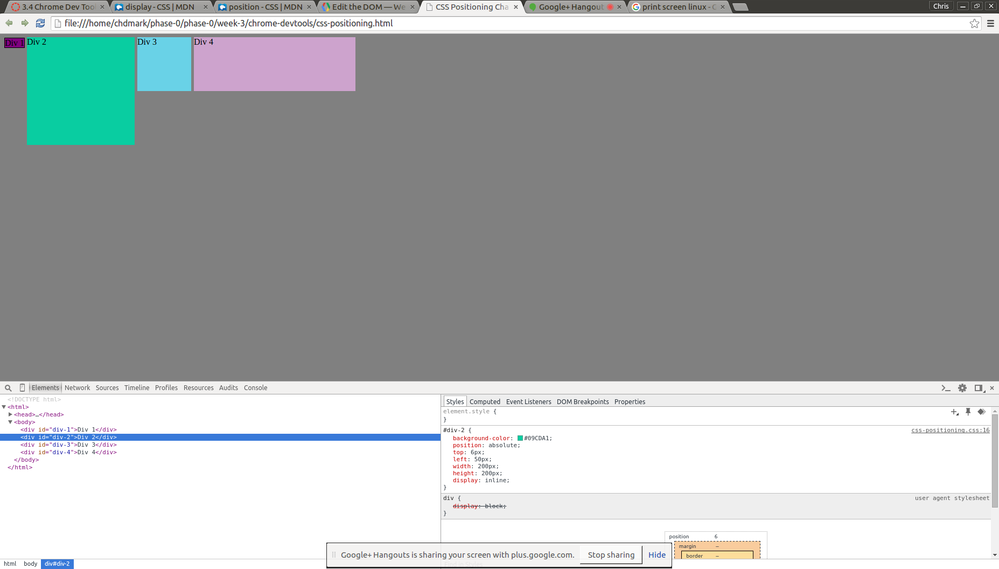
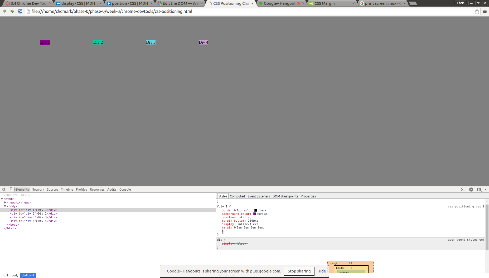
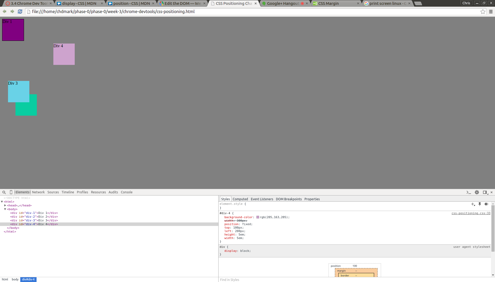
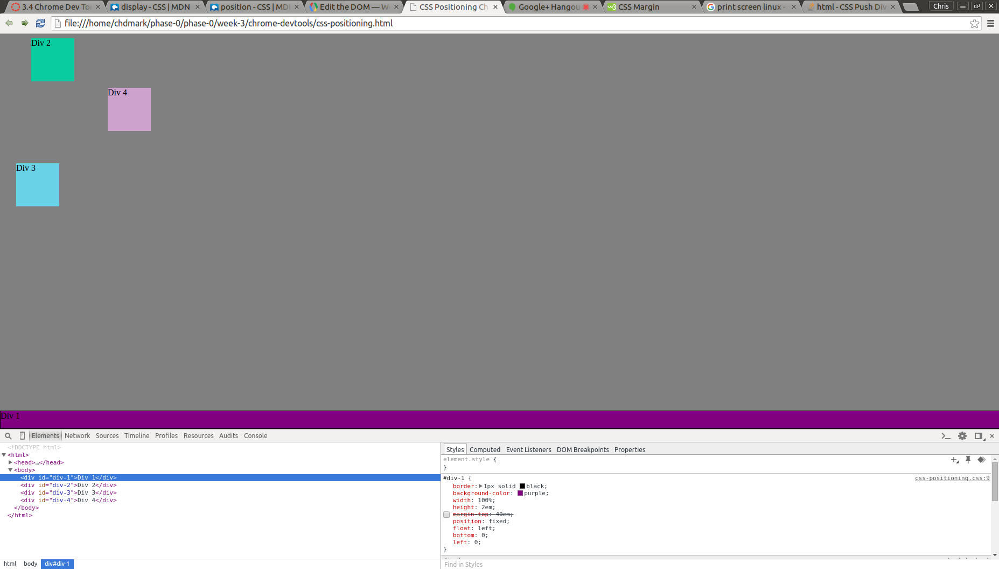
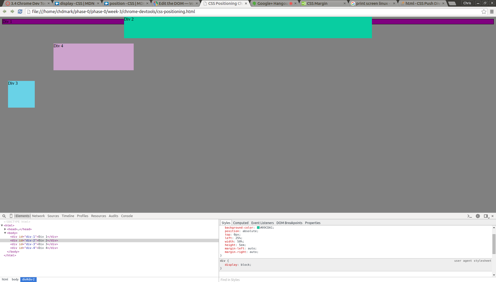
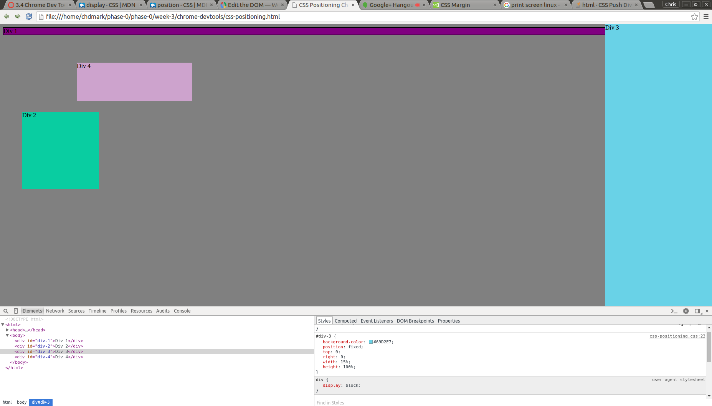
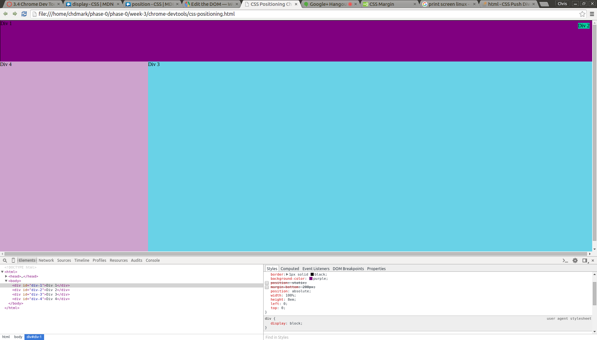

How can you use Chrome's DevTools inspector to help you format or position elements?

How can you resize elements on the DOM using CSS?

What are the differences between Absolute, Fixed, Static, and Relative positioning? Which did you find 
easiest to use? Which was most difficult?

What are the differences between Margin, Border, and Padding?

What was your impression of this challenge overall? (love, hate, and why?)

This challenge was tedious and long, but it was definitely good practice to get used to positioning elements in cSS. You can use Chrome's DevTools inspector to help format and position elements because you can actually edit those elements without affecting the actualy file. You can give your html a "test run" and see how the browser displays your elements. If something seems off, you can use the inspector to change pixels, ems, or certain positionings. 

The Chrome DevTools inspector lets you resize elements. To the right of the inspector, there is the style tab or where the CSS elements are displayed. You can resize the height, width, and even change the margins by typing those elements into the inspector element. Chrome will display those changes real time. 

Understanding the differences between the positions was challening. Working as a pair helped, but we understood the different positions through trial and error. Static positioning is when elements are in their normal flow. There is no special positioning and each element sits on top of one another by default. Relative positioning is when you move an element to where it would have been in normal flow. You can change the positioning from top, right, left, or bottom. Absolute positioning is when an element is taken out of its normal flow. It doesn't affect the other elements' positioning. Fixed positioning is when you position an element and it will stay there. The element will scroll with your browser. I found that the fixed positioning was easiest to use and relative positioning was hrdest to use.

The border property is the box that surrounds the element directly. The margins sit outside the edge of the border. It lets you control the gaps around boxes. The padding elements lets you control how much space is between the border and the content of an element. 

I had mixed feelings about the challenge. My pair and I agreed that it was good to know how to position the elements because we are going to need to design our website positioning elements. However, many aspects were frustrating because it was difficult putting elements in the position you desired. We had to change ems, pxs, height, width, through trial and error. However, we were able to understand fixed and absolutely positioning a little more. 