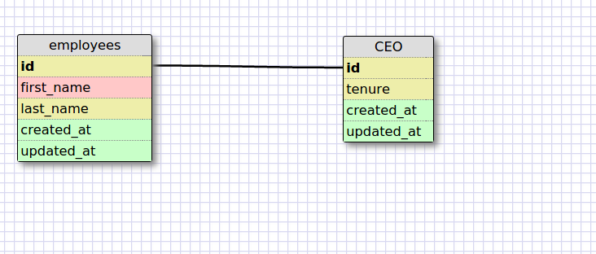
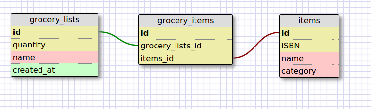

- Release 2: Create a One-to-one Schema

- Release 4: Refactor

- Release 6: Reflect

- What is a one-to-one database?
- When would you use a one-to-one database? (Think generally, not in terms of the example you created).
- What is a many-to-many database?
- When would you use a many-to-many database? (Think generally, not in terms of the example you created).
- What is confusing about database schemas? What makes sense?

A one-to-one database is when the relationshp between the two tables are a pair and only a pair. For example, a person and mailing address would be an example of a one-to-one relationship. You would typically use a one-to-one database when there is one relationship between the parent table and the child table. The key being is that the child table cannot exist without the parent table. 

A many-to-many database is when the relationship have many relationships. For example, many authors could write a book, and vice versa. A many-to-many relationship is usually connected by a join table. They connect the two independent tables together with foreign ids. You would use a many-to-many database to model when multiple relationships can exist between the two tables.

I think conceptually everything makes sense. However, putting everything into practice is a bit confusing. It seems like the most common is the one-to-many relationship.  